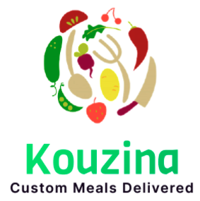

 

# Kouzina
 

  
  

    Notre application Kouzina a pour objectif d’améliorer la carte de choix des plats avec la possibilité de la composition des plats personnalisés selon votre hygiène de vie. Dans un cadre plus large, l’objectif est aussi de créer une communauté d’utilisateurs de l’application qui consomment des produits Healthy et gardent une bonne hygiène de vie.
  

## Features

- Inscription sur l’application mobile des différents acteurs : Chef, Utilisateur, Livreur ;
- Authentification et Gestion du profil en modifiant des informations 
- Consultation des chefs et leurs plats spécifiques et leur localisation
- Gestion du panier où l’utilisateur peut consulter les repas ajoutés;
- Commander des repas
- Consultation l’état des commandes et la carte de déplacement du livreur
- Evaluation des livraisons et des commandes
- Génération d’un code QR pour les détails d’une commande ou d’une recette 
- Contacter le service client par les utilisateurs
- Notification de vente flash envoyés aux utilisateurs
- Gestion des recettes privées et publiques pour les utilisateurs
- Evaluation des chefs, les repas et les recettes selon la popularité

## Requirements

- iOS 13.0+
- Xcode 12.3

## Contribute

We would love you for the contribution to **YourLibraryName**, check the ``LICENSE`` file for more info.

